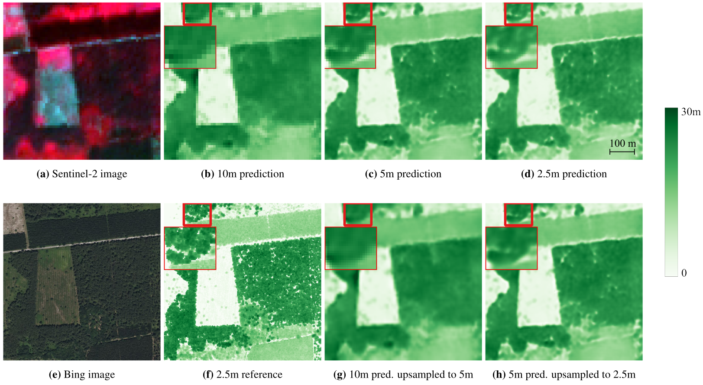

* THREASURE-Net

** Super-Resolved Canopy Height Mapping from Sentinel-2 Time Series Using LiDAR HD Reference Data across Metropolitan France

Fine-scale forest monitoring is essential for understanding canopy structure and its dynamics, which are key indicators of carbon stocks, biodiversity, and forest health.
Deep learning is particularly effective for this task, as it integrates spectral, temporal, and spatial signals that jointly reflect the canopy structure. To address this need, we introduce THREASURE-Net, a novel end-to-end framework for Tree Height REgression And SUper-REsolution. The model is trained on Sentinel-2 time series using reference height metrics derived from LiDAR~HD data at multiple spatial resolutions over Metropolitan France to produce annual height maps.
We evaluate three model variants, producing tree-height predictions at 2.5 m, 5 m, and 10 m resolution.
THREASURE-Net does not rely on any pretrained model, nor on reference very high resolution optical imagery to train its super-resolution module; instead, it learns solely from LiDAR-derived height information.
Our approach outperforms existing state-of-the-art methods based on Sentinel data and is competitive with methods based on very high resolution imagery. It can be deployed to generate high-precision annual canopy-height maps, achieving mean absolute errors of 2.63 m, 2.70 m, and 2.89 m at 2.5 m, 5 m, and 10 m resolution, respectively.
These results highlight the potential of THREASURE-Net for scalable and cost-effective structural monitoring of temperate forests using only freely available satellite data.

* Installation

This project uses Pixi to manage environments and dependencies.

** Requirements

- Git
- Pixi

** Clone the repository

#+begin_src sh
git clone https://github.com/Global-Earth-Observation/threasure-net.git
cd threasure-net
#+end_src

** Install dependencies

Install all dependencies defined in =pyproject.toml=:

#+begin_src sh
pixi install -e gpu
pixi shell -e gpu
conda activate ./.pixi/envs/gpu
#+end_src

** Verify installation

#+begin_src sh
python -c "import torch; print(torch.__version__)"
pytest src/deep_tree/tests
#+end_src

* Model resolution

The model can be run at three different spatial resolutions:

- 2.5 m
- 5 m
- 10 m

Each resolution uses a specific configuration file.

To train model at each resolution, you must run respectively:

#+begin_src sh
python src/bin/train.py experiment=sits_rdb_shuffle_pe_tq_2_5m
python src/bin/train.py experiment=sits_rdb_shuffle_pe_tq_5m
python src/bin/train.py experiment=sits_rdb_pe_tq_10m
#+end_src

To train model at 5m resolution, without acquisition angles:

#+begin_src sh
python src/bin/train.py experiment=sits_rdb_shuffle_pe_tq_no_ang_5m
#+end_src

* Input data

All source data are publicly accessible.
Sentinel-2 imagery was accessed through GEODES [[https://geodes.cnes.fr]],
and LiDAR HD data were obtained from the corresponding national data provider [[https://www.data.gouv.fr/datasets/nuages-de-points-lidar-hd]].
Detailed information on data acquisition, preprocessing, and dataset generation is provided in the manuscript,
enabling interested researchers to recreate the dataset.

The input data must be organized as follows.

** Overview

- Sentinel-2 data and acquisition angles (optional) are used as input data.
- LiDAR HD 95th height percentiles are used as reference data.
- Reference LiDAR masks.

Reference LiDAR masks are used to restrict predictions to tree heights (i.e. permanent vegetation).
Since automatically pre-processed data were used, some seasonal vegetation (e.g. crops) was preclassified as permanent vegetation; crop masks are therefore applied to remove these areas.

LiDAR HD heights can be:
- provided directly at the desired spatial resolution, or
- provided at ANY spatial resolution, in which case the model will handle the resampling.

The spatial resolution of the LiDAR HD heights must be specified in:

=hydra/datamodule/sits.yaml=

#+begin_src yaml
single_tile_config:
  target_resolution: <value>
#+end_src

This resolution can differ from the desired output resolution.

The paths to data should be provided in datamodule configuration.

** Sentinel-2 data

Sentinel-2 time series are organized by S2 tile and patch. A metadata parquet file is associated with each tile. For example:

#+begin_example
30TXT/
├── 30TXT.parquet
├── 0436_6734/
├── ...
├── 0440_6740/
│   ├── SENTINEL2B_20240706_30TXT_0440_6740.tif
│   └── SENTINEL2A_20240919_30TXT_0440_6740.tif
└── ...
#+end_example

The =30TXT.parquet= file contains patch-level metadata associated with the Sentinel-2 acquisitions:

| index | lidarhd_id | context  | lidar_date | lidar_name                                   | s2_date    | sensor      | tile_name | image_name                                   | mask_name                                     | masked_pixels | valid_pixels | ratio_cloud | ratio_border |
|-------+------------+----------+------------+----------------------------------------------+------------+-------------+-----------+----------------------------------------------+-----------------------------------------------+---------------+--------------+-------------+--------------|
| 0     | 0437_6737  | training | 2024-01-27 | percentiles_0437_6737_2024-01-27_0.95.tif | 2024-09-12 | SENTINEL2A | 30TXT     | SENTINEL2A_20240912_30TXT_0437_6737.tif | MASK_SENTINEL2A_20240912_30TXT_0437_6737.tif | 23            | 100          | 7           | 0            |
| 1     | 0437_6742  | training | 2024-01-27 | percentiles_0437_6742_2024-01-27_0.95.tif | 2024-09-12 | SENTINEL2A | 30TXT     | SENTINEL2A_20240912_30TXT_0437_6742.tif | MASK_SENTINEL2A_20240912_30TXT_0437_6742.tif | 100           | 100          | 68          | 0            |
| 3     | 0437_6746  | training | 2024-01-27 | percentiles_0437_6746_2024-01-27_0.95.tif | 2024-09-12 | SENTINEL2A | 30TXT     | SENTINEL2A_20240912_30TXT_0437_6746.tif | MASK_SENTINEL2A_20240912_30TXT_0437_6746.tif | 100           | 100          | 89          | 0            |
| 7     | 0436_6735  | training | 2024-01-27 | percentiles_0436_6735_2024-01-27_0.95.tif | 2024-09-12 | SENTINEL2A | 30TXT     | SENTINEL2A_20240912_30TXT_0436_6735.tif | MASK_SENTINEL2A_20240912_30TXT_0436_6735.tif | 99            | 100          | 0           | 0            |
| 8     | 0441_6747  | training | 2024-01-27 | percentiles_0441_6747_2024-01-27_0.95.tif | 2024-09-12 | SENTINEL2A | 30TXT     | SENTINEL2A_20240912_30TXT_0441_6747.tif | MASK_SENTINEL2A_20240912_30TXT_0441_6747.tif | 83            | 100          | 20          | 0            |

=ratio_border= indicates the proportion of NaN pixels due to partial Sentinel-2 tile coverage from orbit overlaps.

** LiDAR HD data

LiDAR HD patches follow the same S2 tile and patch structure and organized by resolution:

#+begin_example
30TXT/
└── res_1/
    ├── pH95_0440_6740_2024-01-27.tif
    └── ...
#+end_example

Each file contains the 95th height percentile for the corresponding patch.

** Acquisition and solar angles (optional)

Sentinel-2 acquisition and solar angles are stored in a CSV file, organized by S2 tile:

#+begin_example
30TXT.csv
#+end_example

Angles are optional and provided as a vector per patch, as they are available at coarse spatial resolution (≈5 km) and only their ordering is required.

** CSV format

The CSV file must contain the following columns:

| Column name     | Description                                      |
|-----------------|--------------------------------------------------|
| patch_id        | Patch identifier (top left corner coordinates)   |
| image_name      | Sentinel-2 image file name                       |
| x               | X coordinate of the patch center                 |
| y               | Y coordinate of the patch center                 |
| sun_zenith      | Solar zenith angle (degrees)                     |
| sun_azimuth     | Solar azimuth angle (degrees)                    |
| view_zenith     | Sensor viewing zenith angle (degrees)            |
| view_azimuth    | Sensor viewing azimuth angle (degrees)           |

Example:

| patch_id  | image_name                                   | x       | y      | sun_zenith | sun_azimuth | view_zenith | view_azimuth |
|-----------+----------------------------------------------+---------+--------+------------+-------------+-------------+--------------|
| 0440_6740 | SENTINEL2B_20240706_30TXT_0440_6740.tif | 6739500 | 440500 | 27.7       | 149.9       | 2.8         | 134.8        |
| 0437_6752 | SENTINEL2B_20240706_30TXT_0437_6752.tif | 6751500 | 437500 | 27.8       | 149.9       | 3.3         | 129.8        |
| 0447_6749 | SENTINEL2B_20240706_30TXT_0447_6749.tif | 6748500 | 447500 | 27.7       | 150.1       | 2.6         | 138.2        |
| 0436_6747 | SENTINEL2B_20240706_30TXT_0436_6747.tif | 6746500 | 436500 | 27.7       | 149.8       | 3.3         | 130.5        |

* Citation

If you use THREASURE-Net in your research, please cite:

#+begin_src bibtex
@article{threasurenet,
  title   = {Super-Resolved Canopy Height Mapping from Sentinel-2 Time Series Using Airborne LiDAR HD Reference Data across Metropolitan France.},
  author  = {Ekaterina Kalinicheva, Florian Helen, Stéphane Mermoz, Florian Mouret, Milena Planells},
  journal = {Remote Sensing of Environment},
  year    = {2026},
  doi     = {https://doi.org/10.1016/j.rse.2026.115536}
}
#+end_src